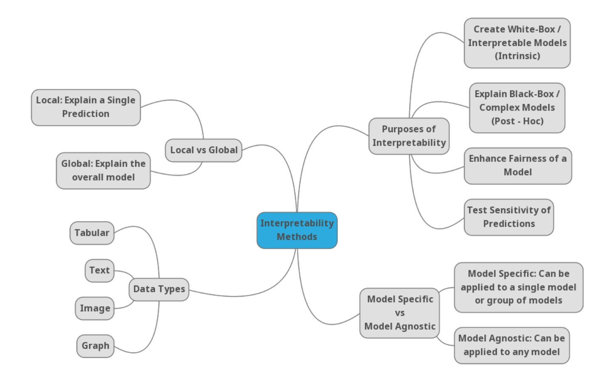

# This hub contains ADVANCED and PROMISING directions in XAI for Deep Neural Networks
There has been a lot of approaches to achieve interpretability in DL; however, there are only few research directions that are promising in 2021. Therefore, I only consider NEW and likely PROMISING directions here. 

## Categories

<!-- I took this picture from [Linardatos et al.](https://www.ncbi.nlm.nih.gov/pmc/articles/PMC7824368/) to show how people are categorizing interpretability methods for Deep Learning smh.

 -->
Below is the layout of this hub:

- Network conceptualization

- Prototype-based explanations

- Inherently-interpretable DNNs

- Evaluation of explanations on down-stream tasks

- Interpreting Large Foundation Models (LLMs)

- Interactive XAI

Other categorizations are reasonable as well (i.e. from [Anh Nguyen](https://github.com/anguyen8/XAI-papers), [Molnar](https://christophm.github.io/interpretable-ml-book/taxonomy-of-interpretability-methods.html), or [lopusz](https://github.com/lopusz/awesome-interpretable-machine-learning)). However, I'd like to curate my own layout.

I also like this [distinction](https://www.youtube.com/watch?v=sl78EgrT4TY)(1:45) between Explainable ML and Interpretable ML by Rudin Cynthia.

### Network conceptualization
This line of research assigns human concepts to learned concepts of DNNs, which can make explanations more human-friendly and specific. Here I just picked a few representative papers, please contribute if any.

- Concept Bottleneck Models https://proceedings.mlr.press/v119/koh20a.html
- Codebook Features: Sparse and Discrete Interpretability for Neural Networks https://arxiv.org/pdf/2310.17230.pdf
- Backpack Language Models https://arxiv.org/abs/2305.16765

-  Network Dissection: Quantifying Interpretability of Deep Visual Representations (**CVPR2017**) - [review ](https://github.com/luulinh90s/paper-review-interpretable-DL/edit/master/reviews/Network_dissection.md)
-  Interpretability Beyond Feature Attribution: Quantitative Testing with Concept Activation Vectors (TCAV) (**ICML2018**) - [review ](https://github.com/luulinh90s/paper-review-interpretable-DL/edit/master/reviews/TCAV.md)
-  Towards Automatic Concept-based Explanations (**NeurIPS2019**) - [review ](https://github.com/luulinh90s/paper-review-interpretable-DL/edit/master/reviews/ACE.md)
-  MILAN - Natural Language Descriptions of Deep Visual Features (**ICLR2022**) - [paper](https://arxiv.org/pdf/2201.11114.pdf)
-  LAVISE - Explaining Deep Convolutional Neural Networks via Unsupervised Visual-Semantic Filter Attention (**CVPR2022**) - [paper](https://openaccess.thecvf.com/content/CVPR2022/papers/Yang_Explaining_Deep_Convolutional_Neural_Networks_via_Latent_Visual-Semantic_Filter_Attention_CVPR_2022_paper.pdf)
-  DISSECT: Disentangled Simultaneous Explanations via Concept Traversals (**ICLR2022**) - [paper](https://arxiv.org/pdf/2105.15164.pdf)

The following works try to mine learned concepts from pretrained models:

- Craft: Concept recursive activation factorization for explainability
  
- A Holistic Approach to Unifying Automatic Concept Extraction and Concept Importance Estimation
  
- COCKATIEL: COntinuous Concept ranKed ATtribution with Interpretable ELements for explaining neural net classifiers on NLP tasks

### Prototype-based explanations
This line of research explains DNNs' decisions using the prototypes (or examples). Hence, it is inherently difficult to evaluate approaches quantitatively.

-  This Looks Like That: Deep Learning for Interpretable Image Recognition (**NIPS2019**) - [review ](https://github.com/luulinh90s/paper-review-interpretable-DL/edit/master/reviews/protoPNET.md)
- This Looks Like It Rather Than That: ProtoKNN For Similarity-Based Classifiers https://openreview.net/forum?id=lh-HRYxuoRr
- Neural Prototype Trees for Interpretable Fine-grained Image Recognition https://arxiv.org/abs/2012.02046 
-  Explaining Latent Representations with a Corpus of Examples (**NeurIPS2021**)
 - A Flexible Nadaraya-Watson Head Can Offer Explainable and Calibrated Classification (Trans. Mach. Learn. Res. 2022)
 - Visual correspondence-based explanations improve AI robustness and human-AI team accuracy https://arxiv.org/abs/2208.00780
 - AdvisingNets: Learning to Distinguish Correct and Wrong Classifications via Nearest-Neighbor Explanations https://arxiv.org/pdf/2308.13651.pdf

### Inherently-interpretable DNNs
This line of research turns existing black-box DNNs (e.g. VGG or ResNet) into white-box models by altering and forcing them to behave in a human understandable manner.

- [SEEING IS BELIEVING: BRAIN-INSPIRED MODULAR TRAINING FOR MECHANISTIC INTERPRETABILITY](https://kindxiaoming.github.io/pdfs/BIMT.pdf)

-  Stop explaining black box machine learning models for high stakes decisions and use interpretable models instead (**Nature Machine Intelligence**) - [review ](https://github.com/luulinh90s/paper-review-interpretable-DL/edit/master/reviews/rudin_nature.md)
-  Concept Whitening for Interpretable Image Recognition (**Nature Machine Intelligence**) - [review ](https://github.com/luulinh90s/paper-review-interpretable-DL/edit/master/reviews/concept_whitening.md)
-  Exploring the cloud of variable importance for the set of all good models (**Nature Machine Intelligence**) - [review ](https://github.com/luulinh90s/paper-review-interpretable-DL/edit/master/reviews/cloud_variable.md)
-  This Looks Like That: Deep Learning for Interpretable Image Recognition (**NIPS2019**) - [review ](https://github.com/luulinh90s/paper-review-interpretable-DL/edit/master/reviews/protoPNET.md)
-  Visual correspondence-based explanations improve AI robustness and human-AI team accuracy (**NeurIPS2022**) - [paper](https://arxiv.org/pdf/2208.00780.pdf)
-  B-cos Networks: Alignment is All We Need for Interpretability (**CVPR2022**) - [paper](https://arxiv.org/pdf/2205.10268.pdf)
-  Neural Additive Models: Interpretable Machine Learning with Neural Nets (**NeurIPS2021**) - [paper](https://arxiv.org/pdf/2004.13912.pdf)

### Evaluation of explanations on down-stream tasks
As humans being the target end-users of explanations, this line of research investigates the actual effectiveness of explanations to humans in various decision-making tasks.

- [Selective Explanations: Leveraging Human Input to Align Explainable AI](https://twitter.com/vivwylai/status/1663948166721576960)

- [Machine Explanations and Human Understanding](https://twitter.com/chachaachen/status/1667218329885618176)

-  Visual correspondence-based explanations improve AI robustness and human-AI team accuracy (**NeurIPS2022**) - [paper](https://arxiv.org/pdf/2208.00780.pdf)

-  The effectiveness of feature attribution methods and
its correlation with automatic evaluation scores (**NeurIPS2021**) - [review ](https://github.com/luulinh90s/paper-review-interpretable-DL/edit/master/reviews/anhnguyen_effect.md)

-  How Well do Feature Visualizations Support Causal Understanding of CNN Activations? (**NeurIPS2021**) - [review ](https://github.com/luulinh90s/paper-review-interpretable-DL/edit/master/reviews/cantpredict_dontunderstand.md)

-  Explainable AI for Natural Adversarial Images (**ICLR2021**) - [review ](https://github.com/luulinh90s/paper-review-interpretable-DL/edit/master/reviews/xai_adv_evaluation.md)

-  Evaluation of Saliency-based Explainability Methods (**ICMLW2021**) - [review ](https://github.com/luulinh90s/paper-review-interpretable-DL/edit/master/reviews/saliency_evaluation.md) 

-  Crowdsourcing Evaluation of Saliency-based XAI Methods (**PKDD2021**)

-  Quality Metrics for Transparent Machine Learning
With and Without Humans In the Loop Are Not Correlated (**ICMLW2021**) - [review ](https://github.com/luulinh90s/paper-review-interpretable-DL/edit/master/reviews/NA.md) 

-  How Can I Explain This to You? An Empirical Study of Deep Neural Network Explanation Methods (**NeurIPS2020**) - [review ](https://github.com/luulinh90s/paper-review-interpretable-DL/edit/master/reviews/jeyakumar2020can.md)

-  Debugging Tests for Model Explanations (**NeurIPS2020**) - [review ](https://github.com/luulinh90s/paper-review-interpretable-DL/edit/master/reviews/debugging_tests.md)

-  What I Cannot Predict, I Do Not Understand: A Human-Centered Evaluation Framework for Explainability Methods (**NeurIPS2022**) - [review ](https://github.com/luulinh90s/paper-review-interpretable-DL/edit/master/reviews/cantpredict_dontunderstand.md)

-  HIVE: Evaluating the Human Interpretability of Visual Explanations (**ECCV2022**) - [review ](https://github.com/luulinh90s/paper-review-interpretable-DL/edit/master/reviews/HIVE.md)

-  Post hoc Explanations may be Ineffective for Detecting Unknown Spurious Correlation (**ICLR2022**) - [review ](https://github.com/luulinh90s/paper-review-interpretable-DL/edit/master/reviews/spurious_signal.md)

- Graphical Perception of Saliency-based Model Explanations, https://dl.acm.org/doi/pdf/10.1145/3544548.3581320

- Humans, AI, and Context: Understanding End-Users’ Trust in a Real-World Computer Vision Application, https://dl.acm.org/doi/pdf/10.1145/3593013.3593978

- A user interface to communicate interpretable AI decisions to radiologists, https://spie.org/Publications/Proceedings/Paper/10.1117/12.2654068?SSO=1

- Help Me Help the AI": Understanding How Explainability Can Support Human-AI Interaction, https://dl.acm.org/doi/abs/10.1145/3544548.3581001
  
- Interpretable deep learning models for better clinician-AI communication in clinical mammography, https://www.spiedigitallibrary.org/conference-proceedings-of-spie/12035/1203507/Interpretable-deep-learning-models-for-better-clinician-AI-communication-in/10.1117/12.2612372.full

- The XAI Alignment Problem: Rethinking How Should We Evaluate Human-Centered AI Explainability Techniques, https://arxiv.org/abs/2303.17707.

- AdvisingNets: Learning to Distinguish Correct and Wrong Classifications via Nearest-Neighbor Explanations https://arxiv.org/pdf/2308.13651.pdf

<!--
## Human vs. machine perception
This line of research compares machine perception vs. human perception using machine explanations.

-  Passive attention in artificial neural networks predicts human visual selectivity (**NeurIPS2021**) - [review ](https://github.com/luulinh90s/paper-review-interpretable-DL/edit/master/reviews/IBG_vs_human_perception.md)
-->

## Interpreting Large Foundation Models
- Rethinking Interpretability in the Era of Large Language Models, https://arxiv.org/html/2402.01761v1
- Towards Monosemanticity: Decomposing Language Models With Dictionary Learning https://transformer-circuits.pub/2023/monosemantic-features
- Toy Models of Superposition https://transformer-circuits.pub/2022/toy_model/index.html

### Interactive XAI (added on Mar 16 2024)
- Explaining decision-making algorithms through UI: Strategies to help non-expert stakeholders
- An Interactive UI to Support Sensemaking over Collections of Parallel Texts
- Rethinking Explainability as a Dialogue: A Practitioner's Perspective
- May I Ask a Follow-up Question? Understanding the Benefits of Conversations in Neural Network Explainability
- Explaining machine learning models with interactive natural language conversations using TalkToModel
- Allowing humans to interactively guide machines where to look does not always improve a human-AI team's classification accuracy

